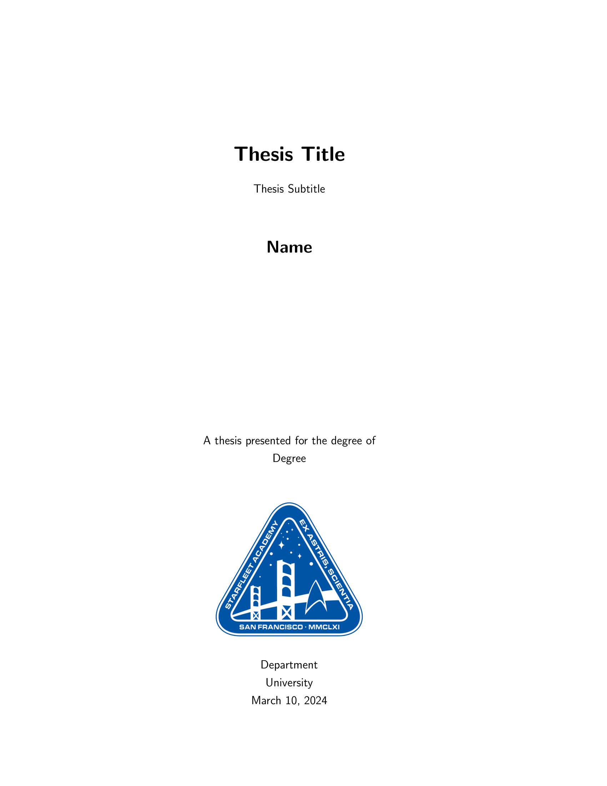
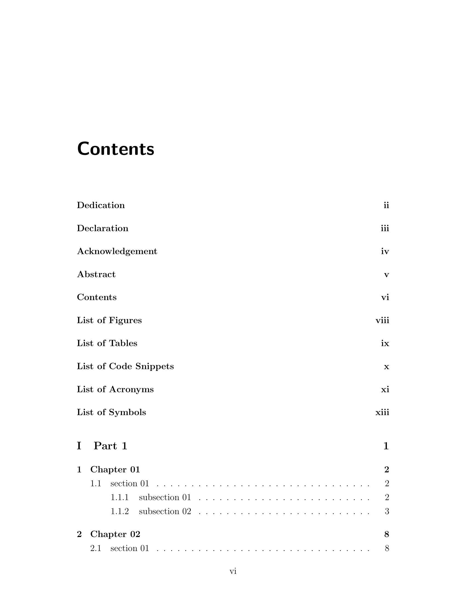
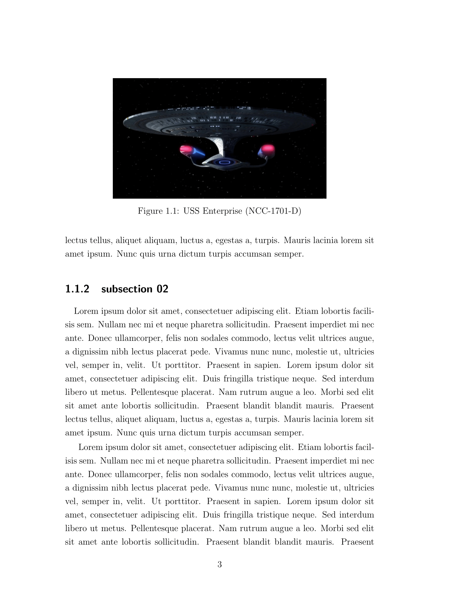
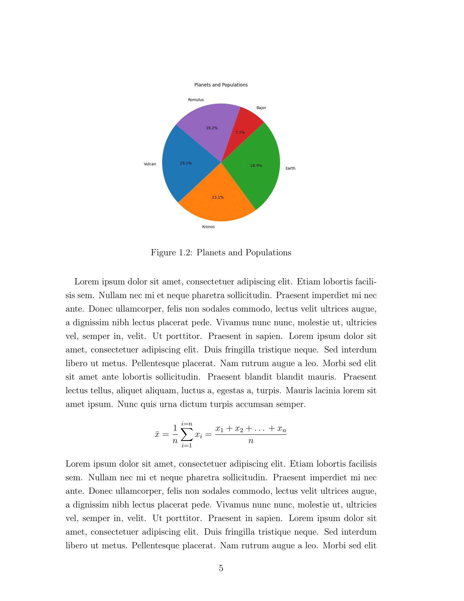
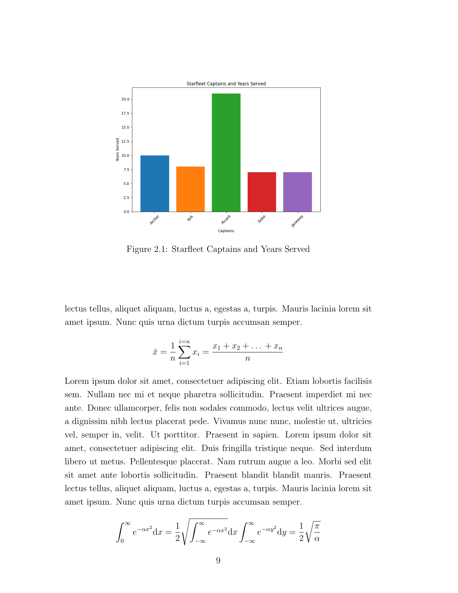
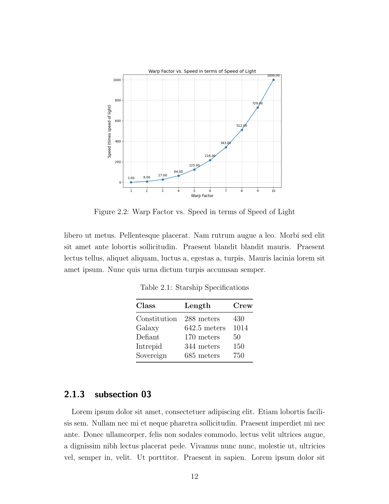
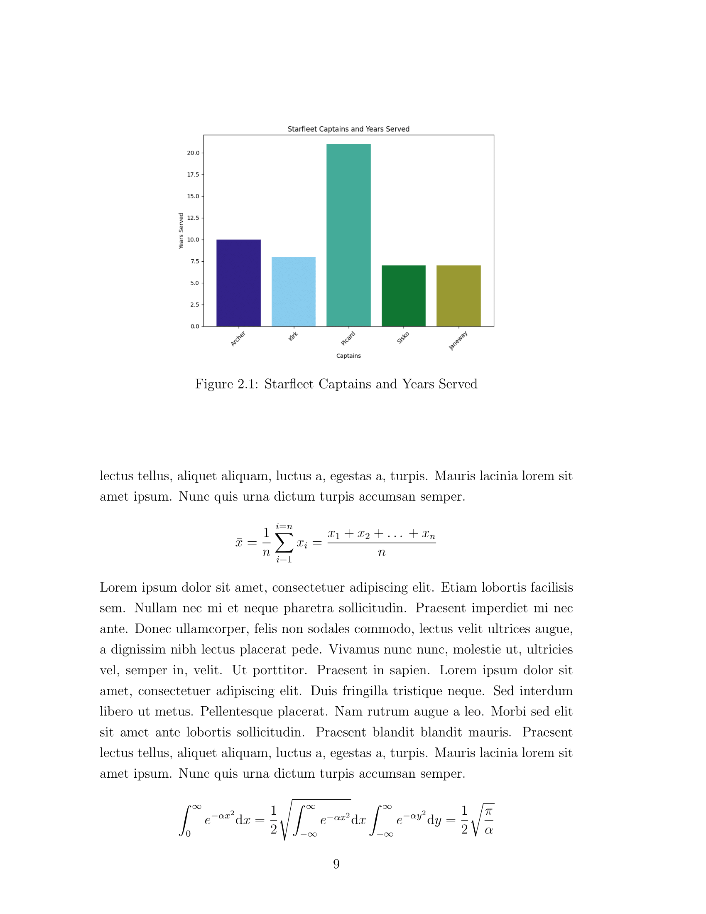
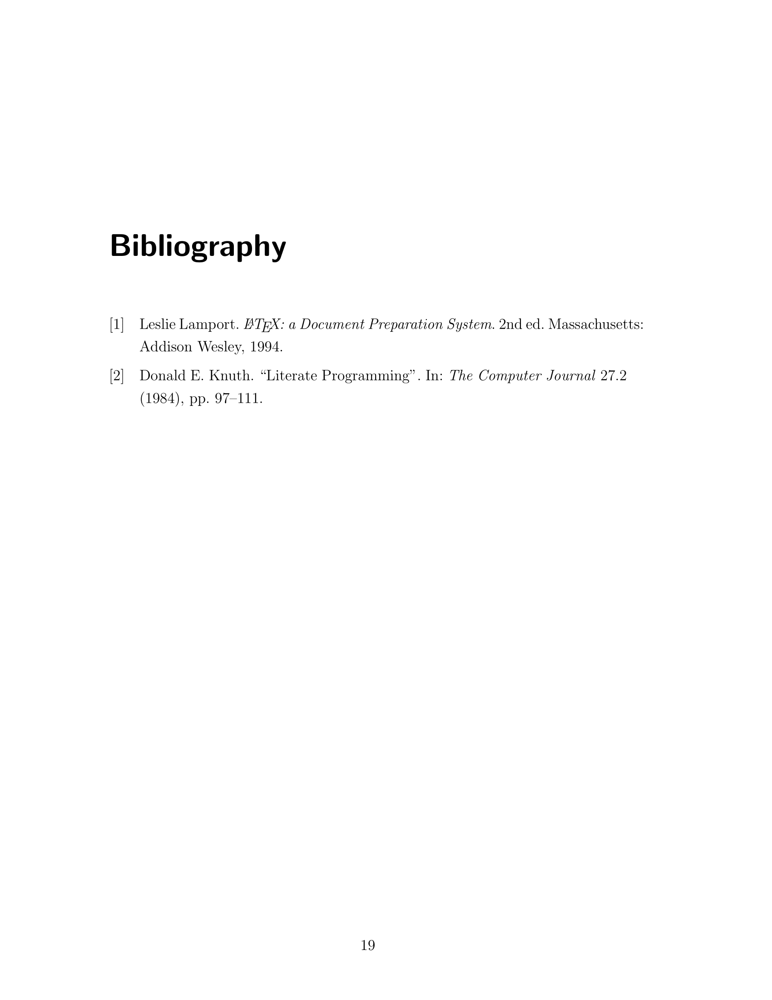

# PhD Thesis Template

GitHub repository for a PhD Thesis template using LaTex.

[](https://www.gnu.org/licenses/gpl-3.0)
[](https://github.com/GuriTheoChem/phd-thesis-template/releases)


## Building the PDF of the Thesis

- To build the pdf of the Thesis, execute the following.

    ```{bash}
    latexmk -pdf -output-directory=build src/main.tex
    ```

    This builds the pdf in the `build/` directory under the file name `main.pdf`.

- To build the plots:

    ```{bash}
    python3 src/generate_plots.py
    ```

- To get the pdf of a particular release version, go to the release and find it in the assets.

## Screenshots

<div style="display: flex; flex-wrap: wrap; justify-content: space-around;">
    
    
</div>

<div style="display: flex; flex-wrap: wrap; justify-content: space-around;">
    
    
</div>

<div style="display: flex; flex-wrap: wrap; justify-content: space-around;">
    
    
</div>

<div style="display: flex; flex-wrap: wrap; justify-content: space-around;">
    
    
</div>

## License

[The GNU General Public License v3.0](https://www.gnu.org/licenses/gpl-3.0.en.html)
