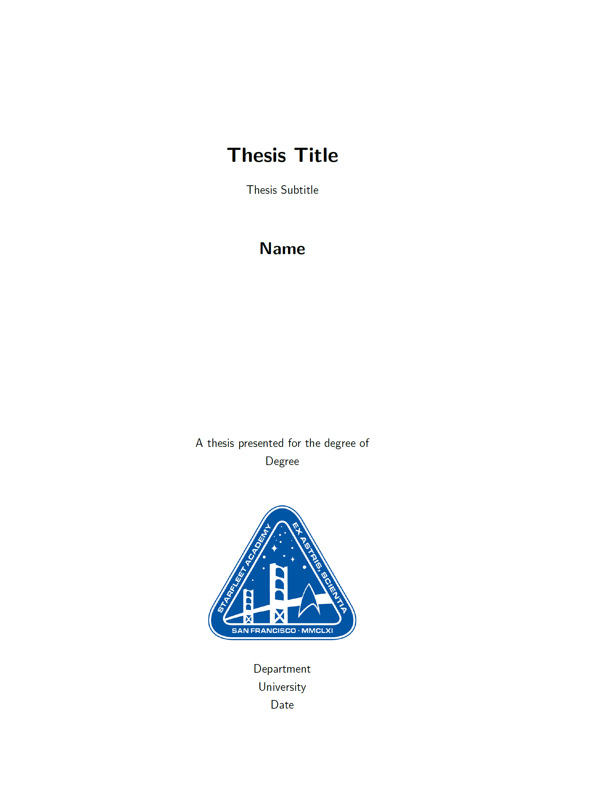

# LaTex Book Template

GitHub repository for a template latex book.

## Building the PDF of the Book

- To build the pdf of the Thesis, execute the following.

    ```{bash}
    latexmk -pdf -output-directory=build src/main.tex
    ```

    This builds the pdf in the `build/` directory under the file name `main.pdf`.

- To build the plots:

    ```{bash}
    python3 src/generate_plots.py
    ```

- To get the pdf of a particular release version, go to the release and find it in the artifacts.

## Screenshots



## License

[The GNU General Public License v3.0](https://www.gnu.org/licenses/gpl-3.0.en.html)
