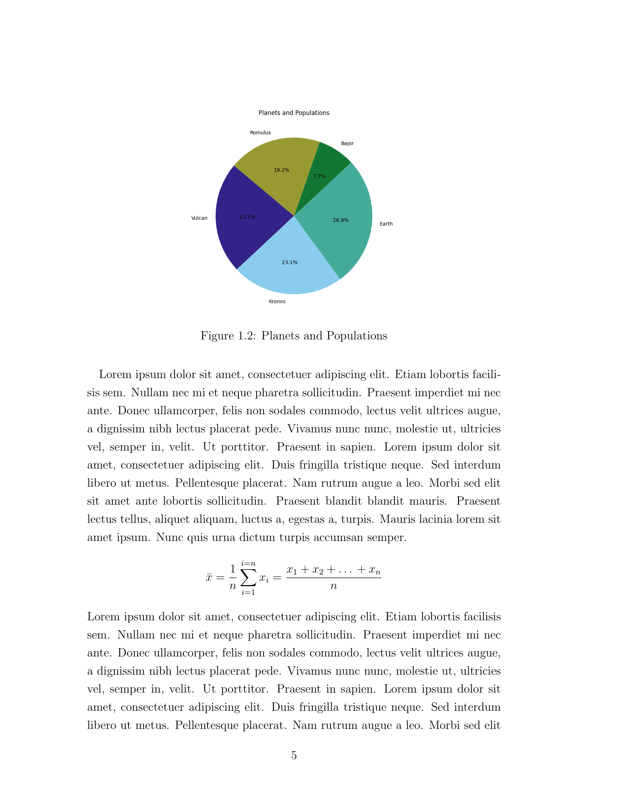

# PhD Thesis Template

GitHub repository for a PhD Thesis template using LaTex.

[](https://www.gnu.org/licenses/gpl-3.0)
[](https://github.com/GuriTheoChem/phd-thesis-template/releases)


## Using the Template

Read this [article](https://docs.github.com/en/repositories/creating-and-managing-repositories/creating-a-repository-from-a-template) from GitHub Docs on how to create a repository from a template.

1. Click Use this template button and select Create a new repository.

   

2. Select with which account you want to create the repository and give it a name.

3. Check out any additional options you want to incorporate.

4. Click Create Repository and you are all set.

## Building the PDF of the Thesis

- To build the pdf of the Thesis, execute the following.

    ```{bash}
    latexmk -pdf -output-directory=build src/main.tex
    ```

    This builds the pdf in the `build/` directory under the file name `main.pdf`.

    > Note: I use `latexmk` for an automated compilation of this template pdf as it has cross-references(bibliography, table of contents). I do not test any other compilers. Please read more about choosing a compiler on this overleaf [article](https://www.overleaf.com/learn/latex/Choosing_a_LaTeX_Compiler#TeX_distributions).

- To build the plots:

    ```{bash}
    python3 src/generate_plots.py
    ```

- To get the pdf of a particular release version, go to the release and find it in the assets.

## Screenshots

<div style="display: flex; flex-wrap: wrap; justify-content: space-around;">
    
    
</div>

<div style="display: flex; flex-wrap: wrap; justify-content: space-around;">
    
    
</div>

<div style="display: flex; flex-wrap: wrap; justify-content: space-around;">
    
    
</div>

<div style="display: flex; flex-wrap: wrap; justify-content: space-around;">
    
    
</div>

## License

[The GNU General Public License v3.0](LICENSE)
